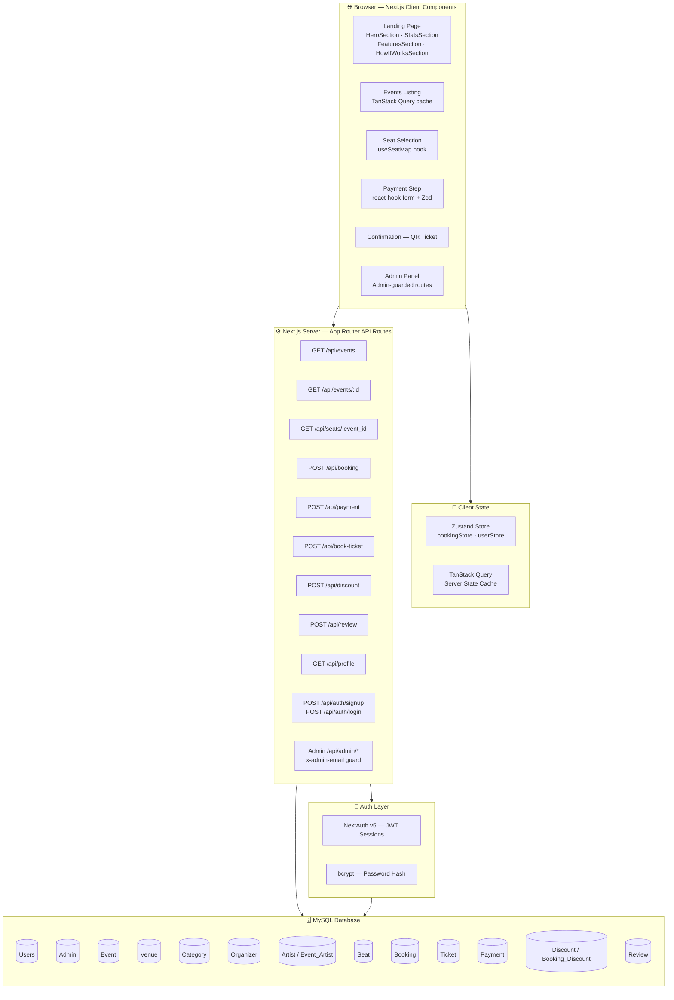

<div align="center">


<br/>

[](https://nextjs.org/)
[](https://www.typescriptlang.org/)
[](https://www.mysql.com/)
[](https://tailwindcss.com/)

<br/>

[](https://www.framer.com/motion/)
[](https://gsap.com/)
[](https://threejs.org/)
[](https://zustand-demo.pmnd.rs/)

<br/>

[](https://react.dev/)
[](https://authjs.dev/)
[](https://tanstack.com/query)
[](https://react-hook-form.com/)
[](https://zod.dev/)
[](https://www.npmjs.com/package/bcrypt)
[](https://lucide.dev/)
[](https://github.com/sidorares/node-mysql2)

<br/>

> **A production-grade, animation-rich event ticket booking platform** — browse events, pick exact seats on a live seat map, apply discount codes, pay securely, and receive a QR-coded e-ticket. Built with Next.js 16 App Router, MySQL, real-time seat locking, a full admin panel, and a motion-rich landing experience that rivals production SaaS.

<br/>

[](https://github.com/lavansh1306/TICKET_BOOKING_SYSTEM/stargazers)
[](https://github.com/lavansh1306/TICKET_BOOKING_SYSTEM/network/members)
[](https://github.com/lavansh1306/TICKET_BOOKING_SYSTEM/issues)

</div>

---

## 📋 Table of Contents

- [🎯 What Is This?](#-what-is-this)
- [🚀 Key Features](#-key-features)
- [🏗️ Architecture](#️-architecture)
- [🗄️ Database Schema](#️-database-schema)
- [📁 Project Structure](#-project-structure)
- [🎨 UI & Animation System](#-ui--animation-system)
- [💸 Pricing Model](#-pricing-model)
- [🔌 API Reference](#-api-reference)
- [⚙️ Getting Started](#️-getting-started)
- [🔐 Environment Variables](#-environment-variables)
- [🗂️ Discount Codes](#️-discount-codes)
- [👤 Roles & Auth](#-roles--auth)
- [🛠️ Tech Stack Deep Dive](#️-tech-stack-deep-dive)
- [🤝 Contributing](#-contributing)

---

## 🎯 What Is This?

**BOOKING_SYSTEM** is a full-stack ticket booking application covering the entire event lifecycle:

```
User registers → browses events → selects exact seats on a live map
  → applies a discount code → pays (Card / Net Banking + OTP)
    → receives a QR-coded e-ticket → leaves a post-event review
```

Admins get a dedicated panel to **create events**, **assign artists**, and **audit all bookings** with payment status in real time.

The platform supports **5 Indian cities**, **5 event categories**, row-based tiered seating (rows A–E), and an animated landing page powered by GSAP SplitText, Framer Motion spring physics, and GSAP ScrollTrigger.

---

## 🚀 Key Features

<table>
<tr>
<td width="50%">

### 🎟️ Booking Engine
- ✅ **Interactive seat map** — live availability from MySQL (`LEFT JOIN Ticket`)
- ✅ **Double-booking protection** via `UNIQUE(seat_id, event_id)` DB constraint
- ✅ **3-step checkout flow** (Select → Pay → Confirm) managed by Zustand
- ✅ **Seat countdown timer** — seats locked during checkout
- ✅ **QR-coded e-ticket** generated on booking confirmation

### 💳 Payments
- ✅ **Card & Net Banking** with OTP verification flow
- ✅ **One-to-one Payment ↔ Booking** (`UNIQUE booking_id`)
- ✅ **Status tracking**: Pending → Completed / Failed / Refunded
- ✅ **Transparent pricing**: subtotal + per-seat convenience fee + 18% GST

</td>
<td width="50%">

### 🎫 Events & Discovery
- ✅ **5 categories**: Movie · Music · Theatre · Comedy · Festival
- ✅ **5 cities**: Chennai · Bangalore · Hyderabad · Mumbai · Delhi
- ✅ **Artist linking** (many-to-many `Event_Artist`)
- ✅ **Real-time seat availability count** per event page

### 🛡️ Auth & Admin
- ✅ **NextAuth v5** session-based auth for users
- ✅ **Bcrypt** password hashing (no plain-text passwords)
- ✅ **Separate admin login** with header-based `x-admin-email` guard
- ✅ **Admin panel**: create events, view all bookings + payment status
- ✅ **Discount codes** with expiry, validated server-side via Zod

### ⭐ Reviews
- ✅ **1–5 star ratings** enforced by DB CHECK constraint
- ✅ **Text comments** stored per user per event

</td>
</tr>
</table>

---

## 🏗️ Architecture



### Request Flow — Full Booking

```
Browser ──► GET /api/events ──────────────────► MySQL: Event JOIN Venue JOIN Category
        ──► GET /api/seats/:id ───────────────► MySQL: Seat LEFT JOIN Ticket
        ──► POST /api/booking ────────────────► INSERT Booking → booking_id
        ──► POST /api/payment ────────────────► INSERT Payment (UNIQUE booking_id)
        ──► POST /api/book-ticket ────────────► INSERT Ticket (UNIQUE seat_id, event_id)
                                                ← QR code + booking_id returned
        ──► GET /api/confirmation ────────────► SELECT Booking JOIN Payment JOIN Ticket
```

---

## 🗄️ Database Schema

<details>
<summary><b>📊 Click to expand full ERD</b></summary>

```
┌─────────────┐       ┌──────────────────┐       ┌─────────────┐
│    Users    │       │     Booking       │       │    Event    │
├─────────────┤  1:N  ├──────────────────┤  N:1  ├─────────────┤
│ user_id  PK │──────►│ booking_id    PK │◄──────│ event_id PK │
│ name        │       │ user_id       FK │       │ event_name  │
│ email UNIQ  │       │ event_id      FK │       │ event_date  │
│ phone       │       │ booking_date     │       │ venue_id  FK│
│ password    │       └──────────────────┘       │ category_id │
└─────────────┘              │                   │ organizer_id│
                             │ 1:1               │ admin_id  FK│
                             ▼                   └─────────────┘
┌─────────────┐       ┌──────────────────┐              │
│   Payment   │       │     Ticket        │         ┌────┴────┐
├─────────────┤       ├──────────────────┤         │         │
│ payment_id  │◄─1:1─►│ ticket_id     PK │    ┌────▼───┐ ┌───▼────────┐
│ booking_id  │       │ booking_id    FK │    │ Venue  │ │  Category  │
│ amount      │       │ seat_id       FK │    ├────────┤ ├────────────┤
│ method      │       │ event_id      FK │    │venue_id│ │category_id │
│ status      │       │ qr_code          │    │ name   │ │ name       │
└─────────────┘       │ UNIQUE(seat_id,  │    │location│ └────────────┘
                      │        event_id) │    │capacity│
                      └──────────────────┘    └────────┘

┌─────────────┐       ┌──────────────────┐
│   Discount  │       │ Booking_Discount  │
├─────────────┤  N:N  ├──────────────────┤
│discount_id  │◄─────►│ booking_id    FK │
│ code  UNIQ  │       │ discount_id   FK │
│ percentage  │       └──────────────────┘
│ expiry_date │
└─────────────┘

┌─────────────┐       ┌──────────────────┐       ┌─────────────┐
│   Artist    │       │  Event_Artist     │       │   Review    │
├─────────────┤  N:N  ├──────────────────┤       ├─────────────┤
│ artist_id   │◄─────►│ event_id      FK │       │ review_id   │
│ artist_name │       │ artist_id     FK │       │ user_id  FK │
│ genre       │       └──────────────────┘       │ event_id FK │
└─────────────┘                                  │ rating 1-5  │
                                                 │ comment     │
┌─────────────┐                                  └─────────────┘
│   Admin     │
├─────────────┤
│ admin_id PK │
│ name        │
│ email UNIQ  │
└─────────────┘
```

</details>

### Key Constraints & Rules

| Constraint | Table | Purpose |
|-----------|-------|---------|
| `UNIQUE(seat_id, event_id)` | `Ticket` | Prevents double-booking any seat |
| `UNIQUE(booking_id)` | `Payment` | Exactly one payment per booking |
| `CHECK(rating BETWEEN 1 AND 5)` | `Review` | Enforces valid star ratings |
| `UNIQUE(email)` | `Users`, `Admin` | No duplicate accounts |
| FK chain `booking_id` | `Payment`, `Ticket` | Full referential integrity |

---

## 📁 Project Structure

```
TICKET_BOOKING_SYSTEM/
│
├── app/                          # Next.js App Router
│   ├── page.tsx                  # Landing page (/)
│   ├── layout.tsx                # Root layout — Inter · JetBrains Mono · Syne fonts
│   ├── globals.css               # Global styles + CSS custom properties
│   │
│   ├── api/                      # REST API route handlers
│   │   ├── auth/                 # login · signup · admin-login · [...nextauth]
│   │   ├── events/               # GET list · GET [id] with reviews + seat counts
│   │   ├── seats/[event_id]/     # GET live seat availability
│   │   ├── booking/              # POST create booking record
│   │   ├── payment/              # POST record payment
│   │   ├── book-ticket/          # POST atomic booking flow
│   │   ├── booking-discount/     # POST link discount to booking
│   │   ├── discount/             # POST validate discount code
│   │   ├── review/               # POST submit star review
│   │   ├── profile/              # GET user booking history
│   │   ├── confirmation/         # GET full booking confirmation
│   │   ├── ticket/               # GET ticket + QR details
│   │   └── admin/                # Admin-guarded endpoints
│   │       ├── events/           # GET list · POST create · [id] update/delete
│   │       ├── bookings/         # GET all bookings with payment info + seats
│   │       └── lookups/          # GET venues, categories, organizers
│   │
│   ├── auth/                     # Login, Register, Admin auth pages
│   └── payment/                  # Payment flow page
│
├── components/
│   ├── landing/                  # Animated landing page sections
│   │   ├── HeroSection.tsx       # GSAP SplitText + Framer Motion 3D floating cards
│   │   ├── StatsSection.tsx      # GSAP ScrollTrigger counter animation + marquee
│   │   ├── FeaturesSection.tsx   # Framer Motion scroll-reveal feature cards
│   │   └── HowItWorksSection.tsx # GSAP horizontal scroll-pinned 4-step carousel
│   ├── layout/                   # AppNavbar · AppFooter
│   ├── payment/                  # PaymentStep component
│   ├── confirmation/             # Booking confirmation view
│   ├── shared/                   # AppProviders (TanStack Query + react-hot-toast)
│   └── ui/                       # Reusable design system
│       ├── Button.tsx            # Shimmer CTA button
│       ├── Input.tsx             # Accessible form input
│       ├── Modal.tsx             # Accessible modal dialog
│       ├── Card.tsx              # Neumorphic-style card
│       ├── Badge.tsx             # Status / label badges
│       ├── StepIndicator.tsx     # Multi-step progress bar
│       ├── CountdownTimer.tsx    # Seat lock countdown
│       └── SkeletonLoader.tsx    # Content loading skeleton
│
├── lib/
│   ├── db.ts                     # MySQL connection pool (mysql2, limit: 10)
│   ├── auth/admin.ts             # Admin x-admin-email header guard + DB lookup
│   ├── queries/                  # Pure database query functions
│   │   ├── events.ts             # getEvents · getEventById · getEventDetails
│   │   ├── booking.ts            # findDiscountByCode · calculateSubtotal · calculateTotal
│   │   ├── payment.ts            # createPendingPayment · resolvePaymentStatus
│   │   └── user.ts               # getUserById · getUserByEmail
│   ├── store/
│   │   ├── bookingStore.ts       # Zustand: selectedSeats, currentStep, discount, pricing
│   │   └── userStore.ts          # Zustand: authenticated user session
│   ├── hooks/
│   │   ├── useBookingFlow.ts     # Multi-step booking navigation (next/prev/reset)
│   │   └── useSeatMap.ts         # Memoized derived seat status map
│   ├── validations/              # Zod input schemas
│   │   ├── auth.ts               # loginSchema · registerSchema
│   │   ├── booking.ts            # bookingSchema
│   │   ├── payment.ts            # paymentSchema
│   │   └── admin.ts              # adminCreateEventSchema
│   ├── utils/                    # formatDate and other helpers
│   └── mock/index.ts             # Full seed dataset (users, events, venues, …)
│
├── types/index.ts                # Shared TypeScript interfaces for all entities
├── scripts/
│   ├── add_seats.js              # Seed Seat rows for all venues
│   └── db_inspect.js             # Inspect DB tables and row counts
│
├── tailwind.config.ts            # Custom animations + brand design tokens
├── next.config.mjs               # Next.js config (remote image patterns)
└── tsconfig.json                 # TypeScript path aliases (@/)
```

---

## 🎨 UI & Animation System

The landing page is built as a **motion-first experience**. Here is every animation running under the hood:

| Animation | Library | Component | What It Does |
|-----------|---------|-----------|-------------|
| **SplitText headline** | GSAP SplitText | `HeroSection` | Each character animates in with `yPercent: 120`, `rotateX: -60`, stagger `0.018s` |
| **Floating 3D event cards** | Framer Motion | `HeroSection` | Parallax scroll + mouse tilt via `rotateX`/`rotateY` useSpring |
| **Magnetic CTA button** | Framer Motion | `HeroSection` | Button follows cursor with spring physics |
| **Shimmer button sheen** | Tailwind | `Button` | CSS `backgroundPosition` sweeps `200% → -200%` on loop |
| **Scroll counter** | GSAP ScrollTrigger | `StatsSection` | Numbers count from 0 to target when section enters viewport |
| **SVG line draw** | GSAP ScrollTrigger | `StatsSection` | `strokeDashoffset` animates to 0 on scroll |
| **Marquee ticker** | Tailwind CSS | `StatsSection` | Infinite smooth venue/event name scroll |
| **Horizontal carousel** | GSAP ScrollTrigger (pinned) | `HowItWorksSection` | 4 panels scroll horizontally while page scrolls vertically |
| **Draw-on checkmark** | GSAP | `HowItWorksSection` | Step 4 `strokeDashoffset` → 0 when panel enters view |
| **Scroll-reveal cards** | Framer Motion | `FeaturesSection` | `x: 60 → 0` slide-in with `0.12s` staggered delays |
| **Floating ambient orbs** | Tailwind CSS | `HeroSection` | Radial-gradient blobs with `animate-float` |
| **Bouncing scroll indicator** | GSAP yoyo | `HeroSection` | `ChevronDown` yoyos `y: 0 → 10` on 1.2s loop |
| **Step progress dots** | CSS Transition | `HowItWorksSection` | Active dot scales up + glows `rgba(182,91,58,0.6)` |

### Custom Tailwind Keyframe Animations

```ts
// tailwind.config.ts
animation: {
  float:            "float 6s ease-in-out infinite",        // ambient orbs
  marquee:          "marquee 25s linear infinite",           // ticker tape
  shimmer:          "shimmer 2s linear infinite",            // CTA sheen
  "pulse-glow":     "pulse-glow 2s ease-in-out infinite",   // glow ring
  draw:             "draw 2s ease forwards",                 // SVG stroke
  "fade-in-up":     "fade-in-up 0.6s ease-out forwards",    // entrance
  "scale-in":       "scale-in 0.4s cubic-bezier(...)",      // pop-in
  "slide-in-right": "slide-in-right 0.5s ease-out forwards" // slide
}
```

### Design Tokens — Brand Colour Palette

| Colour | Hex | Usage |
|--------|-----|-------|
| Terracotta | `#B65B3A` | Primary CTA, active states, accents |
| Deep Espresso | `#241B16` | Headings |
| Warm Mocha | `#6D5A4E` | Body copy |
| Ivory | `#F8F4EE` | Hero background |
| Warm Sand | `#EEE4D6` | Stats section |
| Cream | `#F4EBDD` | How It Works section |
| Emerald | `#22C55E` | Available seats, confirmed status |
| Amber | `#F59E0B` | Low-inventory warning |

### Typography System

| Variable | Font | Used For |
|----------|------|---------|
| `--font-inter` | Inter | Body text, UI |
| `--font-jetbrains-mono` | JetBrains Mono | Code, stats, labels |
| `--font-display` | Syne | Hero headlines, section titles |

---

## 💸 Pricing Model

Seat price is determined by the row letter (closest to stage = most expensive):

| Row | Price per Seat | Description |
|-----|---------------|-------------|
| **A** | ₹500 | Front row — premium |
| **B** | ₹400 | Second row |
| **C** | ₹300 | Middle |
| **D** | ₹200 | Upper middle |
| **E** | ₹150 | Back row |

**Total calculation (enforced in `bookingStore.ts`):**

```
Subtotal      = Σ SEAT_PRICE[row prefix] for each selected seat
Discount      = Subtotal × (discount.percentage / 100)  [if valid code applied]
ConvFee       = ₹29 × number of seats
GST           = ConvFee × 18%
────────────────────────────────────────────────────────────────
Total         = max(0, Subtotal − Discount + ConvFee + GST)
```

---

## 🔌 API Reference

<details>
<summary><b>🎪 Events</b></summary>

| Method | Endpoint | Auth | Description |
|--------|----------|------|-------------|
| `GET` | `/api/events` | None | All events — JOINs Venue, Category, Organizer, Artists |
| `GET` | `/api/events/:id` | None | Single event with reviews, total seats, available seats |

**Sample response — GET /api/events:**
```json
{
  "data": [{
    "event_id": 2,
    "event_name": "AR Rahman Concert",
    "event_date": "2026-05-05",
    "venue": { "venue_name": "Music Arena Bangalore", "location": "Bangalore", "capacity": 500 },
    "category": { "category_name": "Music" },
    "organizer": { "name": "Sonic Live", "contact": "+91-8000000102" },
    "artists": [{ "artist_name": "AR Rahman", "genre": "Music" }]
  }]
}
```

</details>

<details>
<summary><b>🪑 Seats</b></summary>

| Method | Endpoint | Auth | Description |
|--------|----------|------|-------------|
| `GET` | `/api/seats/:event_id` | None | All seats for the event's venue with live `available` / `booked` status |

</details>

<details>
<summary><b>📋 Booking</b></summary>

| Method | Endpoint | Auth | Description |
|--------|----------|------|-------------|
| `POST` | `/api/booking` | User | Create a Booking record — returns `booking_id` |
| `POST` | `/api/book-ticket` | User | Atomic: create Booking + Tickets + Booking_Discount link |
| `POST` | `/api/booking-discount` | User | Link a validated discount to a booking |
| `GET` | `/api/profile` | User | All bookings for authenticated user |
| `GET` | `/api/confirmation` | User | Full confirmation: Booking + Payment + Tickets + Seats |

**POST /api/booking — body:**
```json
{ "user_id": 1, "event_id": 2, "booking_date": "2026-05-01" }
```

</details>

<details>
<summary><b>💳 Payment</b></summary>

| Method | Endpoint | Auth | Description |
|--------|----------|------|-------------|
| `POST` | `/api/payment` | User | Insert Payment row (UNIQUE booking_id enforced) |

**POST /api/payment — body:**
```json
{
  "booking_id": 42,
  "amount": 1045.22,
  "payment_method": "Credit Card",
  "status": "Completed"
}
```

</details>

<details>
<summary><b>🏷️ Discounts & Reviews</b></summary>

| Method | Endpoint | Auth | Description |
|--------|----------|------|-------------|
| `POST` | `/api/discount` | None | Validate a discount code — checks expiry `>= CURDATE()` |
| `POST` | `/api/review` | User | Submit a 1–5 star review with comment |

**POST /api/discount — body:** `{ "code": "FESTIVE" }`  
**Response:** `{ "data": { "discount_id": 2, "code": "FESTIVE", "percentage": 20, "expiry_date": "2026-12-31" } }`

</details>

<details>
<summary><b>🔐 Authentication</b></summary>

| Method | Endpoint | Auth | Description |
|--------|----------|------|-------------|
| `POST` | `/api/auth/signup` | None | Register new user — bcrypt hashed, stored in Users table |
| `POST` | `/api/auth/login` | None | Credential login — issues NextAuth JWT session |
| `POST` | `/api/auth/admin-login` | None | Admin login against Admin table |

</details>

<details>
<summary><b>🛠️ Admin Panel (Protected)</b></summary>

All admin routes require `x-admin-email` header matching a verified row in the `Admin` table.

| Method | Endpoint | Description |
|--------|----------|-------------|
| `GET` | `/api/admin/events` | List all events |
| `POST` | `/api/admin/events` | Create new event (Zod validated) |
| `GET` | `/api/admin/events/:id` | Event details |
| `GET` | `/api/admin/bookings` | All bookings with user info, seats, payment status |
| `GET` | `/api/admin/lookups` | Venues, categories, organizers for form dropdowns |

**POST /api/admin/events — body:**
```json
{
  "event_name": "Summer Bash",
  "event_date": "2026-08-20",
  "venue_id": 2,
  "category_id": 2,
  "organizer_id": 2
}
```

</details>

---

## ⚙️ Getting Started

### Prerequisites

- **Node.js** 18+ and **npm**
- **MySQL 8+** (local, [PlanetScale](https://planetscale.com/), [Railway](https://railway.app/), or [Aiven](https://aiven.io/))

### 1 — Clone & Install

```bash
git clone https://github.com/lavansh1306/TICKET_BOOKING_SYSTEM.git
cd TICKET_BOOKING_SYSTEM
npm install
```

### 2 — Configure Environment

```bash
# Copy the template and fill in your values
cp .env.example .env.local
```

### 3 — Set Up the Database

Create your MySQL database and run the DDL (see [Database Schema](#️-database-schema) above).  
Then seed the seats and verify:

```bash
node scripts/add_seats.js     # Populate Seat rows for all 5 venues
node scripts/db_inspect.js    # Verify table row counts
```

### 4 — Run Development Server

```bash
npm run dev
```

Open [http://localhost:3000](http://localhost:3000) 🚀

### 5 — Production Build

```bash
npm run build
npm start
```

---

## 🔐 Environment Variables

Create `.env.local` in the project root:

```env
# ── MySQL ─────────────────────────────────────
DB_HOST=localhost
DB_PORT=3306
DB_USER=root
DB_PASSWORD=your_db_password
DB_NAME=booking_system

# ── NextAuth ──────────────────────────────────
NEXTAUTH_SECRET=your_super_secret_key_at_least_32_chars
NEXTAUTH_URL=http://localhost:3000
```

> **Never commit `.env.local`** — it is already in `.gitignore`.

---

## 🗂️ Discount Codes

These codes are seeded and ready to use at checkout:

| Code | Discount | Expiry |
|------|----------|--------|
| `NEWUSER` | 10% off | Dec 31, 2026 |
| `SUMMER` | 15% off | Dec 31, 2026 |
| `FESTIVE` | 20% off | Dec 31, 2026 |
| `SPECIAL` | 25% off | Dec 31, 2026 |
| `VIP` | 30% off | Dec 31, 2026 |

Codes are validated **server-side** with `expiry_date >= CURDATE()` — no client-side bypass possible.

---

## 👤 Roles & Auth

```
┌──────────────────────────────────────┐   ┌──────────────────────────────────────┐
│          Regular User                │   │               Admin                  │
├──────────────────────────────────────┤   ├──────────────────────────────────────┤
│ • Register / Login (NextAuth v5)     │   │ • Login via /auth/admin              │
│ • Browse all events                  │   │ • Create & manage events             │
│ • Interactive seat selection         │   │ • View all bookings system-wide      │
│ • Apply discount codes               │   │ • See payment status per booking     │
│ • Pay (Card / Net Banking)           │   │ • Access venue/category lookups      │
│ • View profile & booking history     │   │ (Guarded by x-admin-email header)    │
│ • Download QR-coded e-ticket         │   └──────────────────────────────────────┘
│ • Submit post-event star reviews     │
└──────────────────────────────────────┘
```

---

## 🛠️ Tech Stack Deep Dive

| Layer | Technology | Why It Was Chosen |
|-------|-----------|-------------------|
| **Framework** | Next.js 16 (App Router) | Server components, file-based routing, co-located API routes, RSC streaming |
| **Language** | TypeScript 5 | End-to-end type safety — DB interfaces → API response → UI props |
| **Database** | MySQL 8 + mysql2/promise | Relational integrity, JOINs, `UNIQUE` / `CHECK` constraints, connection pooling |
| **Auth** | NextAuth v5 | Credential providers, JWT sessions, easy OAuth extension path |
| **Password Hashing** | bcrypt 6 | Adaptive cost-factor hashing — no plain-text passwords |
| **Global State** | Zustand 5 | Zero-boilerplate, minimal re-renders for booking flow + user session |
| **Server State** | TanStack Query 5 | Intelligent caching, background refetch, loading/error states |
| **Forms** | React Hook Form 7 + Zod 4 | Performant uncontrolled forms with schema-first validation |
| **Animations (scroll)** | GSAP 3 + ScrollTrigger | SplitText headlines, horizontal pin carousel, counter animations |
| **Animations (interaction)** | Framer Motion 12 | Spring physics, 3D tilt, scroll-driven parallax |
| **3D Graphics** | Three.js 0.184 | WebGL scenes — available for confirmation ticket 3D card |
| **Styling** | Tailwind CSS 3 | Utility-first with custom keyframe animations and design tokens |
| **Icons** | Lucide React 1.11 | Tree-shakable, consistent SVG icon set |
| **Notifications** | react-hot-toast 2.6 | Non-intrusive toast feedback |
| **Fonts** | Inter · JetBrains Mono · Syne | Clean hierarchy: body · mono data · display headings |

---

## 🤝 Contributing

1. **Fork** the repository
2. Create a feature branch: `git checkout -b feat/your-feature`
3. Commit your changes: `git commit -m "feat: add your feature"`
4. Push to the branch: `git push origin feat/your-feature`
5. Open a **Pull Request**

Please follow the existing conventions — TypeScript strict mode, Zod validation on all API inputs, and Tailwind-only styling.

---

<div align="center">


**Built with ❤️ by [Lavansh](https://github.com/lavansh1306)**

*If this project helped you, please consider giving it a ⭐*

[](https://github.com/lavansh1306)

</div>
